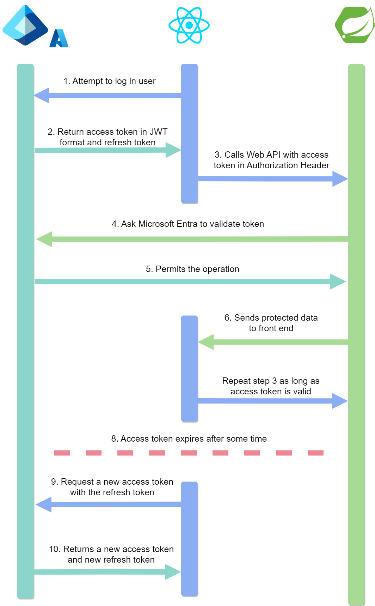

# Spring authenticator
<p>
    <div style="text-align: center;">
        </a>
        
    </div>
</p>

This project provides an authentication API to be used by other applications to identify their users.

# Table of Contents
- [Spring authenticator](#spring-authenticator)
- [Table of Contents](#table-of-contents)
  - [Getting Started](#getting-started)
    - [Prerequisites](#prerequisites)
    - [Environment variables and application properties](#environment-variables-and-application-properties)
  - [Docker](#docker)
    - [Run dev environment using docker](#run-dev-environment-using-docker)
    - [Run test environment using docker](#run-test-environment-using-docker)
    - [Do actions from within Docker (CLI)](#do-actions-from-within-docker-cli)
  - [What's next ?](#whats-next)
  - [Microsoft Entra Azure AD oAuth2](#microsoft-entra-azure-ad-oauth2)
  - [Commands cheat-sheet](#commands-cheat-sheet)
    - [Simplified sequence diagram](#simplified-sequence-diagram)
- [Sources](#sources)

## Getting Started
These instructions will get you a copy of the project up and running on your local machine for development and testing purposes.

### Prerequisites
The Spring Boot version currently used in this project is 3.3.5.

The project's environment must contain these tools. Make sure that your Windows or WSL environnment variables contain the path to Java.

- [Java / openJDK 21](https://adoptium.net/fr/temurin/releases/)
- [Maven 3.9](https://maven.apache.org/docs/history.html)
- [MariaDB 11.4](https://mariadb.org/mariadb/all-releases/)

#### Docker (optional)

It is recommanded to develop the app using docker.
This is not a hard requirement but it's highly encouraged.
For more info, head to the [Docker section](#docker) of this documentation.

- [Docker Desktop](https://www.docker.com/products/docker-desktop/)
- [Docker-compose](https://docs.docker.com/compose/)
- On linux or WSL (allready included in Docker Desktop): [Docker-buildx](https://github.com/docker/buildx)

### Environment variables and application properties

#### `.env` file
This file is used by Docker to configure the containers. The environment variables defined in `.env` can be transmitted to the container and the Spring Boot app through the `compose.yml` file.

1. DON'T modify the `env-dist` file but make a copy of it in the root folder.
2. Rename your copied file to `.env`.
3. If needed, change the values of the environment variables defined.

`.env` file defines :
- The environment (dev, test or prod)
- The port to use for the Spring Boot app container
- The dev or test database URL and credentials. Prod database informations should only be defined as environment variables in the production environment.

#### `application.properties` files
These files are used by Spring Boot to configure the application. They can contain hard coded values or use environment variables as values.

The `application.properties` file located in the root folder is git ignored and let's you define configurations specific to your local environment or informations that must not be synchronized in the GIT repository. Secret keys for example.

1. DON'T modify the `application.properties-dist` file but make a copy of it in the root folder.
2. Rename your copied file to `application.properties`.
3. Open the file in you editor and set the configurations you want. They will override the configurations defined in the src/main/resources folder.

## Docker

In this app, we use docker-compose, a Docker wrapper.
It allows you and other programmers to work in a same development or testing environment, starting a database container and a Spring Boot app container wich are working together.

The main commands you'll have to use are described in the [commands cheat-sheet](#commands-cheat-sheet) sub-section.

### Run dev environment using docker
First, you need to build the containers :

1. Make sure `ENVIRONMENT=dev` is set in `.env` !
2. Open a terminal and go to your root folder
3. If needed, reset containers and volumes (datas) with `docker compose down -v`
4. Use the command `docker compose build`
5. Now that the containers have been built, you can start them with `docker compose up`

Note that each time you change the `ENVIRONMENT` variables, you need to use
the command `docker compose build` you can also use the short `docker compose up --build` command.

### Run test environment using docker
1. Make sure `ENVIRONMENT=test` is set in `.env` !
2. Open a terminal and go to your root folder
3. If needed, reset containers and volumes (datas) with `docker compose down -v`
4. In the root folder, use the command `docker compose build`
5. Now that the containers have been built, you can start them with `docker compose up`

### Do actions from within Docker (CLI)

To manipulate your application from within a container, you simply need to
enter it using the command `docker exec -it <container name> sh`.

You're now using the container's terminal.

## Maven package

### Package the project in a .jpa archive
As the tests are meant to run in a Docker environment, we have to skip them when creating a .jpa archive.

Use this command :

```
mvn clean package -DskipTests
```

## Commands cheat-sheet

Here is a list of the most common commands you'll likely use !

### Docker
Build containers
`docker compose build`

Start containers
`docker compose up`

run in background
`docker compose up -d`

stop containers
`docker compose down`

stop containers and delete volumes, wich are containing app datas
`docker compose down -v`

Enter a container with shell
`docker exec -it <container name> sh`

### Maven
Run the app
`mvn spring-boot:run`

Downloads all the dependencies without building or compiling the app
`mvn dependency:resolve`

Same as `mvn dependency:resolve` but displays the dependency tree
`mvn dependency:tree`

Removes the previously built artefacts and .JAR file
`mvn clean`

Build the project into a .JAR file
`mvn package`

Check if the project's structure is valid
`mvn validate`

## Microsoft Entra Azure AD oAuth2

### Simplified sequence diagram
<p>
    
</p>


## Sources

[Microsoft oAuth2 grant flow](https://learn.microsoft.com/en-us/entra/identity-platform/v2-oauth2-auth-code-flow)

---

## Spring REST Docs

The application work with an automated documentation from the Spring REST Docs package that is created when it run with docker and the test environment

It creates an .adoc file in src/asciidoc and an html page in the docs that can be consulted in github

Link to the generated .adoc : [src/asciidoc/index.adoc](src/asciidoc/index.adoc)

Link to the generated .html : [src/asciidoc/index.html](docs/index.html)

Link to the doc : [https://orifinformatique.github.io/spring-auth/](https://orifinformatique.github.io/spring-auth/)

## Application Documentation
[Processes documentation](/docs/process-documentation.md)