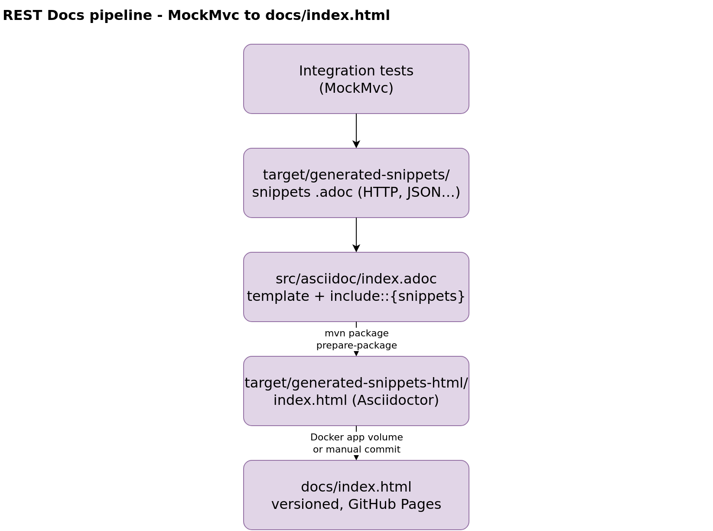
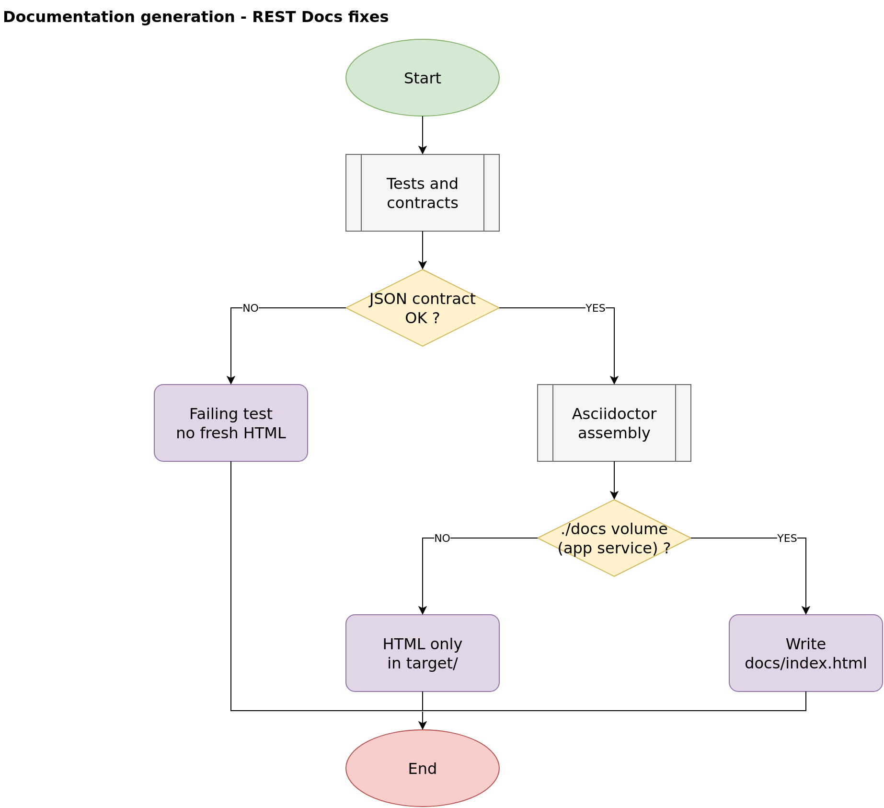
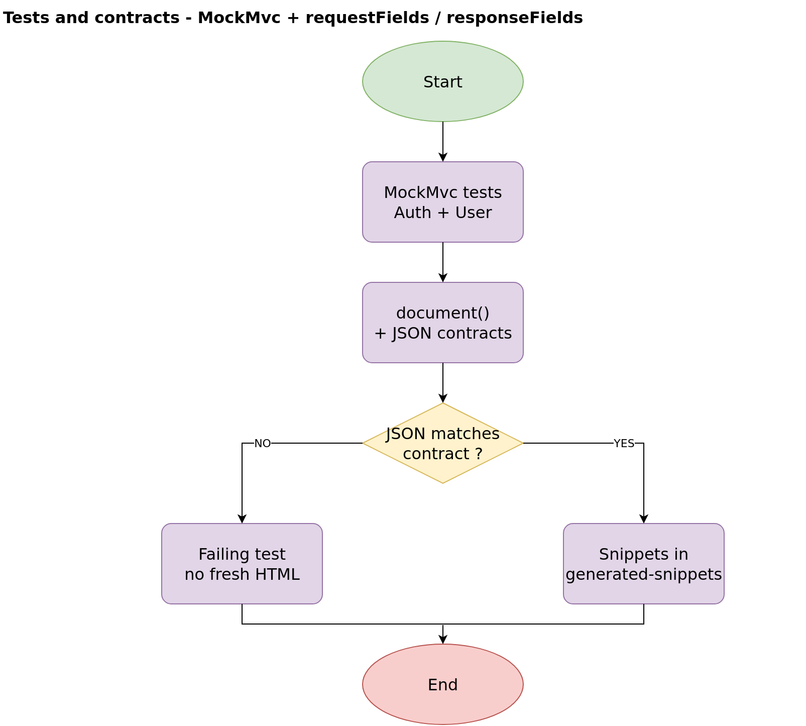
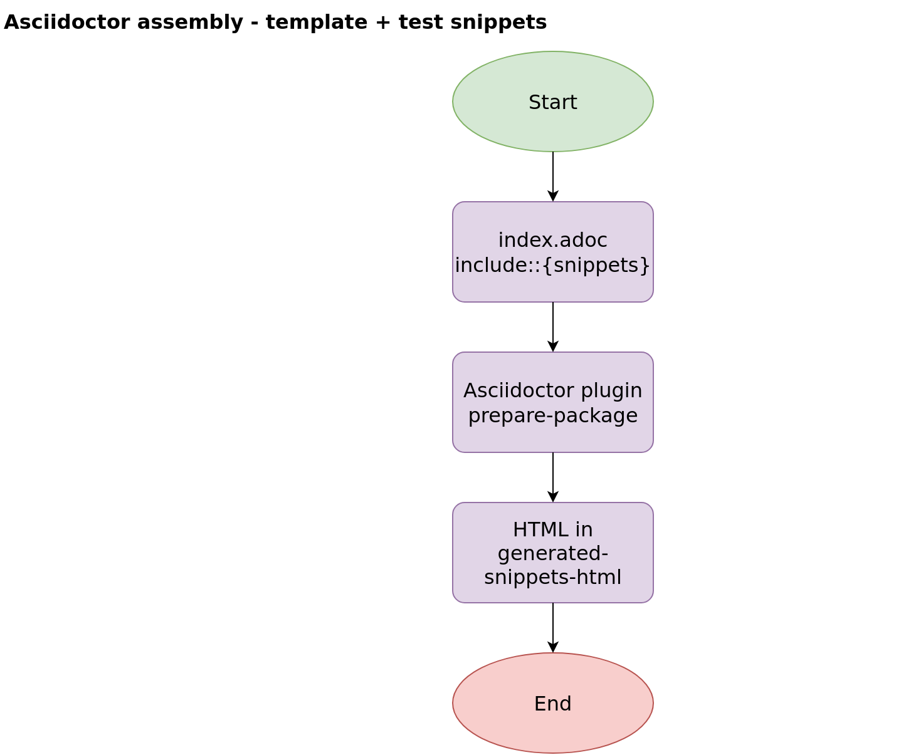
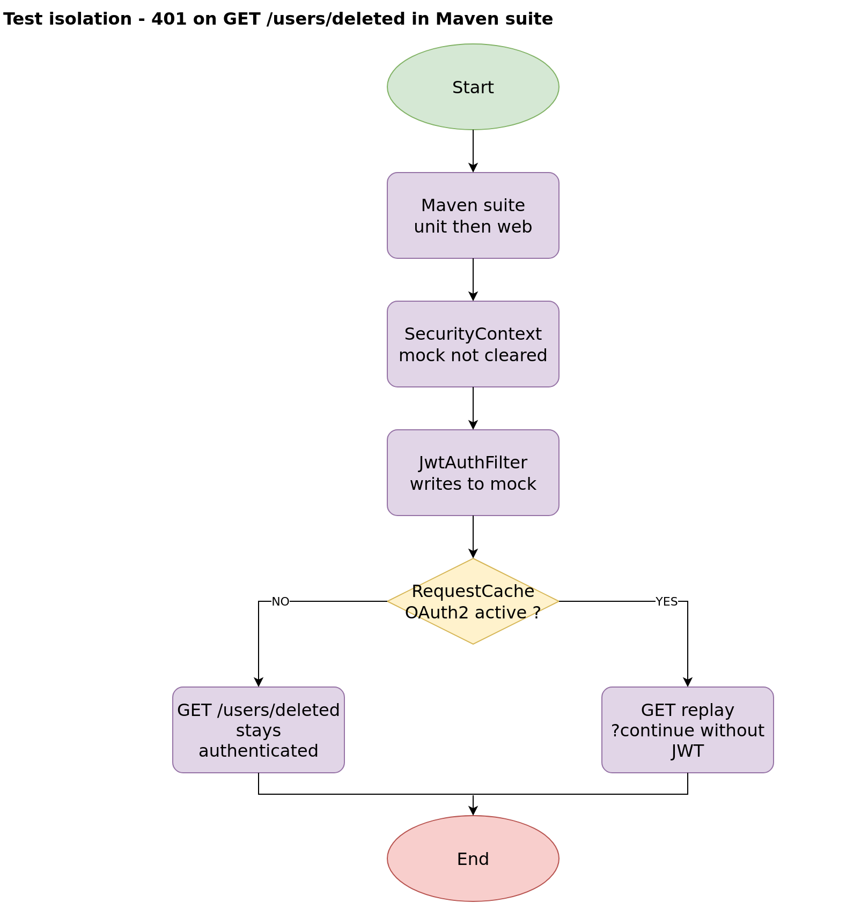

# API documentation generation (Spring REST Docs)

Annex to the [README](../README.md). It describes **how** spring-auth HTTP documentation is produced, verified, and published.

Consumer-facing documentation remains [index.html](index.html) (HTML) and [src/asciidoc/index.adoc](../src/asciidoc/index.adoc) (AsciiDoc template).

## Pipeline overview

Library: **Spring REST Docs** (`spring-restdocs-mockmvc` 3.0.1).

Source: [process/restdocs-pipeline.drawio](process/restdocs-pipeline.drawio)



Tests **do not** generate `index.adoc`: only the AsciiDoc template is maintained by hand. HTTP examples come from the tests.

## Diagram 1: parent process

Source: [restdocs-generation.drawio](process/restdocs-generation.drawio) (page **« 1. Generation documentation »**)



Summary:

1. Run integration tests with `document(...)` and, on happy paths, JSON contracts (`RestDocsSnippets`).
2. If a JSON field no longer matches the contract, the test fails: no HTML rebuilt from stale examples.
3. If tests pass, Asciidoctor assembles `index.adoc` and the snippets.
4. Maven writes HTML to `target/generated-snippets-html/`.
5. Depending on the execution context, `docs/index.html` is updated or not (see below).

## Diagram 2: tests and contracts

Source: [restdocs-generation.drawio](process/restdocs-generation.drawio) (page **« 2. Tests and contracts »**)



Classes involved:

- `AuthControllerIntegrationTest`
- `UserControllerIntegrationTest`
- `RestDocsSnippets` (centralized `requestFields` / `responseFields` contracts)

Configuration:

```java
@AutoConfigureRestDocs(outputDir = "target/generated-snippets")
```

Each `document("auth/…" or "users/…", …, snippets)` call produces a folder under `target/generated-snippets/`, for example:

```
target/generated-snippets/auth/login/http-request.adoc
target/generated-snippets/auth/login/request-fields.adoc
target/generated-snippets/auth/login/response-fields.adoc
```

## Diagram 3: Asciidoctor assembly

Source: [restdocs-generation.drawio](process/restdocs-generation.drawio) (page **« 3. Asciidoctor assembly »**)



At the top of `index.adoc`:

```adoc
ifndef::snippets[]
:snippets: ../../target/generated-snippets
endif::[]
```

Then includes such as:

```adoc
include::{snippets}/auth/login/http-request.adoc[]
```

The Maven plugin `asciidoctor-maven-plugin` (phase `prepare-package`) reads `src/asciidoc/index.adoc` and writes HTML to `target/generated-snippets-html/` (`pom.xml`, Maven attribute `<snippets>`).

## Diagram 4: test isolation (401)

Source: [restdocs-generation.drawio](process/restdocs-generation.drawio) (page **« 4. Isolation tests 401 »**)



Separate process, related to test suite reliability (and therefore documentation), not HTML generation itself.

Related fixes in `SecurityConfig` and tests:

- `@AfterEach`: `SecurityContextHolder.clearContext()`
- Two `SecurityFilterChain` beans (stateless JWT API vs OAuth2 with session)
- `requestCache` disabled on the API chain
- `JwtAuthFilter` not registered as a servlet filter (`FilterRegistrationBean` disabled)

## Where does the HTML land?

| Command / context | Snippets | HTML output | `docs/index.html` updated? |
|---|---|---|---|
| `scripts/java-env.sh mvn test` | Yes | No | No |
| `scripts/java-env.sh mvn package` | Yes | `target/generated-snippets-html/` | No (unless copied manually) |
| `mvn clean package` on the host | Yes | `target/` | No (unless copied / committed) |
| `docker compose up` (`app` service, `./docs` volume) | Yes | mapped to `./docs/` | **Yes** (direct volume write) |

Compose volume on the `app` service:

```yaml
- ./docs:/app/target/generated-snippets-html
```

Without this volume (`java` container, `workspace` profile), regenerating docs only changes `target/`. To version `docs/index.html`, you must **commit** the file afterward.

## Common commands

Recommended build environment (JDK 21 + Maven 3.9 + MariaDB, no Java on the host):

```bash
scripts/java-env.sh up
scripts/java-env.sh mvn -Dspring.profiles.active=test verify
scripts/java-env.sh mvn clean package
```

Inspect snippets:

```bash
ls target/generated-snippets/auth/login/
```

Open HTML locally:

```bash
# generated by Maven
xdg-open target/generated-snippets-html/index.html

# committed copy in the repo
xdg-open docs/index.html
```

## Regenerate PNG exports

From the project root (Docker required):

```bash
for f in restdocs-pipeline restdocs-generation; do
  docker run --rm \
    -v "$PWD/docs/process:/data" \
    rlespinasse/drawio-export:v4.6.0 \
    -f png -t -s 2 -o /data/export /data/${f}.drawio
done
cp docs/process/export/restdocs-pipeline-Pipeline-REST-Docs.png docs/process/export/restdocs-pipeline.png
```

Options: `-t` transparent background, `-s 2` scale 2×. Edit `.drawio` files with [diagrams.net](https://app.diagrams.net/) or the Draw.io Integration extension.

## Maintenance rule

Any change to the pipeline or detailed processes must update the Draw.io files (`restdocs-pipeline.drawio`, `restdocs-generation.drawio`) **and** the PNGs in `process/export/` **in the same commit** as the code or text documentation.

After an API change:

1. Update tests and `RestDocsSnippets` if JSON payloads change.
2. Regenerate snippets and HTML (`verify` then `package`).
3. Update `docs/index.html` if published documentation must follow.
4. Update this document or the Draw.io diagrams if the flow changes.

## Keeping documentation in sync manually

| File | Role | When to edit |
|---|---|---|
| `src/asciidoc/index.adoc` | Structure and snippet includes | New documented endpoint, new section |
| Integration tests + `document(...)` | HTTP snippets | New endpoint, request/response change |
| `RestDocsSnippets` | JSON field contracts | Field added, removed, or renamed |
