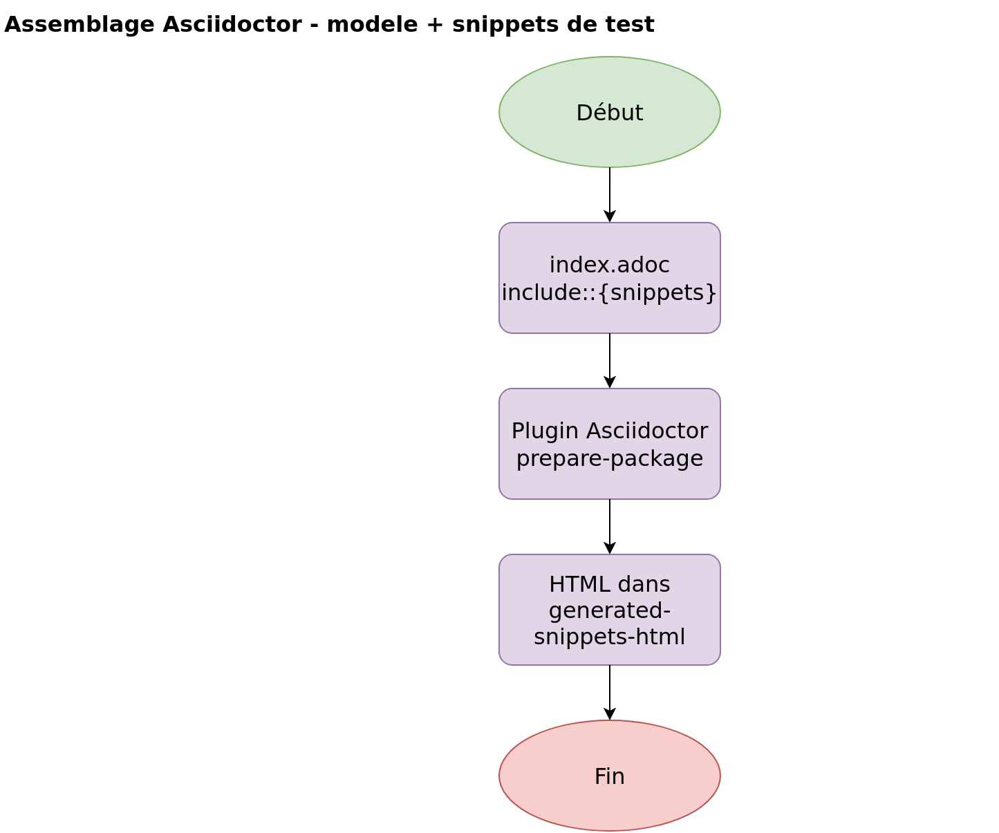

# Génération de la documentation API (Spring REST Docs)

Document annexe du [README](../README.md). Il décrit **comment** la documentation HTTP de spring-auth est produite, vérifiée et publiée.

La doc consommable par les intégrateurs reste [index.html](index.html) (HTML) et [src/asciidoc/index.adoc](../src/asciidoc/index.adoc) (modèle AsciiDoc).

## Vue d'ensemble du pipeline

Librairie : **Spring REST Docs** (`spring-restdocs-mockmvc` 3.0.1).

Source : [process/restdocs-pipeline.drawio](process/restdocs-pipeline.drawio)


Les tests **ne créent pas** `index.adoc` : seul le modèle AsciiDoc est maintenu à la main. Les extraits HTTP proviennent des tests.

## Schéma 1 : processus parent

Source : [restdocs-generation.drawio](process/restdocs-generation.drawio) (page **« 1. Generation documentation »**)


Étapes résumées :

1. Lancer les tests d'intégration avec `document(...)` et, sur les happy paths, des contrats JSON (`RestDocsSnippets`).
2. Si un champ JSON ne correspond plus au contrat, le test échoue : pas de HTML reconstruit à partir d'exemples obsolètes.
3. Si les tests passent, Asciidoctor assemble `index.adoc` et les snippets.
4. Maven écrit le HTML dans `target/generated-snippets-html/`.
5. Selon le contexte d'exécution, `docs/index.html` est mis à jour ou non (voir ci-dessous).


## Schéma 2 : tests et contrats

Source : [restdocs-generation.drawio](process/restdocs-generation.drawio) (page **« 2. Tests et contrats »**)


Classes concernées :

- `AuthControllerIntegrationTest`
- `UserControllerIntegrationTest`
- `RestDocsSnippets` (contrats `requestFields` / `responseFields` centralisés)

Configuration :

```java
@AutoConfigureRestDocs(outputDir = "target/generated-snippets")
```

Chaque appel `document("auth/…" ou "users/…", …, snippets)` produit un dossier sous `target/generated-snippets/`, par exemple :

```
target/generated-snippets/auth/login/http-request.adoc
target/generated-snippets/auth/login/request-fields.adoc
target/generated-snippets/auth/login/response-fields.adoc
```


## Schéma 3 : assemblage Asciidoctor

Source : [restdocs-generation.drawio](process/restdocs-generation.drawio) (page **« 3. Assemblage Asciidoctor »**)



En tête de `index.adoc` :

```adoc
ifndef::snippets[]
:snippets: ../../target/generated-snippets
endif::[]
```

Puis des includes du type :

```adoc
include::{snippets}/auth/login/http-request.adoc[]
```

Le plugin Maven `asciidoctor-maven-plugin` (phase `prepare-package`) lit `src/asciidoc/index.adoc` et écrit le HTML dans `target/generated-snippets-html/` (`pom.xml`, attribut Maven `<snippets>`).

## Schéma 4 : isolation des tests (401)

Source : [restdocs-generation.drawio](process/restdocs-generation.drawio) (page **« 4. Isolation tests 401 »**)


Processus à part, lié à la fiabilité de la suite de tests (donc à la doc), pas à la génération HTML elle-même.

Correctifs associés dans `SecurityConfig` et les tests :

- `@AfterEach` : `SecurityContextHolder.clearContext()`
- Deux `SecurityFilterChain` (API JWT stateless vs OAuth2 avec session)
- `requestCache` désactivé sur la chaîne API
- `JwtAuthFilter` non enregistré comme filtre servlet (`FilterRegistrationBean` désactivé)


## Où le HTML atterrit-il ?


| Commande / contexte                                  | Snippets | HTML produit                      | `docs/index.html` mis à jour ?           |
| ---------------------------------------------------- | -------- | --------------------------------- | ---------------------------------------- |
| `scripts/java-env.sh mvn test`                       | Oui      | Non                               | Non                                      |
| `scripts/java-env.sh mvn package`                    | Oui      | `target/generated-snippets-html/` | Non (sauf copie manuelle)                |
| `mvn clean package` sur l'hôte                       | Oui      | `target/`                         | Non (sauf copie / commit)                |
| `docker compose up` (service `app`, volume `./docs`) | Oui      | mappé vers `./docs/`              | **Oui** (écriture directe sur le volume) |


Le volume Compose du service `app` :

```yaml
- ./docs:/app/target/generated-snippets-html
```

Sans ce volume (conteneur `java` du profil `workspace`), regénérer la doc ne modifie que `target/`. Pour versionner `docs/index.html`, il faut ensuite **committer** le fichier.

## Commandes usuelles

Environnement de build recommandé (JDK 21 + Maven 3.9 + MariaDB, sans Java sur l'hôte) :

```bash
scripts/java-env.sh up
scripts/java-env.sh mvn -Dspring.profiles.active=test verify
scripts/java-env.sh mvn clean package
```

Vérifier les snippets :

```bash
ls target/generated-snippets/auth/login/
```

Ouvrir le HTML local :

```bash
# généré par Maven
xdg-open target/generated-snippets-html/index.html

# version commitée dans le repo
xdg-open docs/index.html
```


## Regénérer les exports PNG

Depuis la racine du projet (Docker requis) :

```bash
for f in restdocs-pipeline restdocs-generation; do
  docker run --rm \
    -v "$PWD/docs/process:/data" \
    rlespinasse/drawio-export:v4.6.0 \
    -f png -t -s 2 -o /data/export /data/${f}.drawio
done
cp docs/process/export/restdocs-pipeline-Pipeline-REST-Docs.png docs/process/export/restdocs-pipeline.png
```

Options : `-t` fond transparent, `-s 2` échelle 2×. Éditer les `.drawio` avec [diagrams.net](https://app.diagrams.net/) ou l'extension Draw.io Integration.

## Règle de maintenance

Toute modification du pipeline ou des processus détaillés doit mettre à jour les fichiers Draw.io (`restdocs-pipeline.drawio`, `restdocs-generation.drawio`) **et** les PNG dans `process/export/` **dans le même commit** que le code ou la doc texte.

Après changement d'API :

1. Adapter les tests et `RestDocsSnippets` si le JSON change.
2. Regénérer snippets + HTML (`verify` puis `package`).
3. Mettre à jour `docs/index.html` si la doc publiée doit suivre.
4. Mettre à jour ce document ou le Draw.io si le flux change.

