# Application Documentation

## Table of Contents

- [Application Documentation](#application-documentation)
  - [Table of Contents](#table-of-contents)
  - [Documentation Tools](#documentation-tools)
  - [Overview](#overview)
  - [1. Spring-Auth](#1-spring-auth)
    - [1.1 General Information](#11-general-information)
    - [1.2 Root Files](#12-root-files)
    - [1.3 Root Folders](#13-root-folders)
    - [1.4 Source Structure (`src`)](#14-source-structure-src)
      - [1.4.1 `main`](#141-main)
      - [1.4.2 `test`](#142-test)
    - [1.5 Main Java Modules (`main/java`)](#15-main-java-modules-mainjava)
    - [1.6 Security Module (`main/java/security`)](#16-security-module-mainjavasecurity)
    - [1.7 Auth Module (`main/java/auth`)](#17-auth-module-mainjavaauth)
    - [1.8 Users Module (`main/java/user`)](#18-users-module-mainjavauser)
    - [1.9 Configuration Module (`main/java/config`)](#19-configuration-module-mainjavaconfig)
    - [1.10 Error and Exception Management (`main/java/app`)](#110-error-and-exception-management-mainjavaapp)
    - [1.11 Test Structure (`test/java`)](#111-test-structure-testjava)
    - [1.12 Security Tests (`test/java/security`)](#112-security-tests-testjavasecurity)
    - [1.13 Authentication Tests (`test/java/auth`)](#113-authentication-tests-testjavaauth)
    - [1.14 User Tests (`test/java/user`)](#114-user-tests-testjavauser)
    - [1.15 External Integrations (Microsoft Entra ID / Azure AD)](#115-external-integrations-microsoft-entra-id--azure-ad)
      - [1.15.1 OAuth2 Integration (Azure AD)](#1151-oauth2-integration-azure-ad)
      - [1.15.2 OAuth2 Scopes and Claims](#1152-oauth2-scopes-and-claims)
  - [2. API Endpoints Summary](#2-api-endpoints-summary)
    - [2.1 Authentication Endpoints (`/auth`)](#21-authentication-endpoints-auth)
    - [2.2 OAuth2 Endpoints (`/oauth2`)](#22-oauth2-endpoints-oauth2)
    - [2.3 User Management Endpoints (`/users`)](#23-user-management-endpoints-users)
  - [3. Testing and Documentation](#3-testing-and-documentation)
    - [3.1 Environment Profiles](#31-environment-profiles)
    - [3.2 Test Execution](#32-test-execution)
    - [3.3 API Documentation Generation](#33-api-documentation-generation)
  - [4. Security Architecture](#4-security-architecture)
    - [4.1 Authentication Flow](#41-authentication-flow)
    - [4.2 Role-Based Access Control](#42-role-based-access-control)
    - [4.3 Password Security](#43-password-security)
  - [5. Database Schema](#5-database-schema)
    - [5.1 Key Tables](#51-key-tables)
    - [5.2 Soft Delete Pattern](#52-soft-delete-pattern)
  - [6. Additional Resources](#6-additional-resources)

---

## Documentation Tools

Recommended Mermaid Preview Tool [Markdown Preview Mermaid Support](https://marketplace.visualstudio.com/items?itemName=bierner.markdown-mermaid).

---

## Overview

This document describes the **structure, components, and processes** of the spring-auth application, including configuration files, folder organization, and module responsibilities.

This application powers a **authentication system**, providing:

- Secure authentication and authorization (delegated to spring-auth)
- User and role management

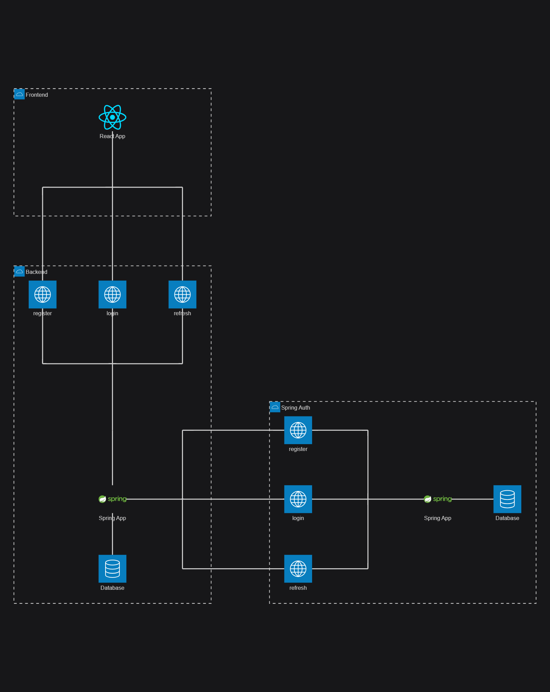  
_Illustrates interactions between the frontend and backend modules of the `template_frontback` app, as well as the `spring-auth` app._

---

## 1. Spring-Auth

### 1.1 General Information

The `spring-auth` module is a standalone Spring Boot application that provides authentication and authorization services. It manages user credentials, roles, and permissions, and integrates with Microsoft Entra Azure AD for OAuth2 authentication.

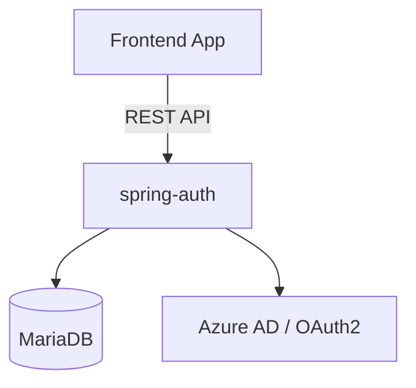
```mermaid
graph TD
    A[Frontend App] -->|REST API| B[spring-auth]
    B --> C[(MariaDB)]
    B --> D[Azure AD / OAuth2]
```

**Tools & Dependencies:**

- **Java / OpenJDK:** 21
- **Spring Boot:** 3.5.8
- **Maven:** 3.9+
- **MariaDB:** 11.4
- **Docker Desktop:** Latest

**Key Libraries:**

- **Spring Security:** Authentication and authorization framework
- **Spring Data JPA:** Database access and ORM
- **Spring OAuth2 Client:** Microsoft Entra ID (Azure AD) integration
- **Auth0 Java-JWT (4.4.0):** JWT token generation and validation
- **MapStruct (1.6.3):** Java bean mappings and DTO conversions
- **Lombok (1.18.38):** Reduces boilerplate code
- **Spring REST Docs (3.0.1):** API documentation generation
- **Jakarta Validation:** Bean validation and custom constraints
- **Dotenv Java:** Environment variable management

> **Note:** Detailed setup and run instructions are provided in the project's main [`README.md`](../README.md).

---

### 1.2 Root Files

| File                     | Description                                                      |
| ------------------------ | ---------------------------------------------------------------- |
| `pom.xml`                | Defines project dependencies, plugins, and build configurations. |
| `init.sql`               | SQL script to create and initialize the database schema.         |
| `Dockerfile`             | Defines Docker image build stages and application setup.         |
| `compose.yml`            | Configures Docker environment and additional services.           |
| `application.properties` | Global configuration properties for Spring Boot.                 |
| `.env`                   | Environment variables for local development and deployment.      |
| `README.md`              | Project overview, setup instructions, and documentation links.   |

---

### 1.3 Root Folders

| Folder   | Description                                           |
| -------- | ----------------------------------------------------- |
| `src`    | Contains the application’s source code and resources. |
| `target` | Compiled classes and build artifacts.                 |
| `docs`   | Documentation.                                        |

---

### 1.4 Source Structure (`src`)

#### 1.4.1 `main`

Contains the core functionality of the application.

- **`java`** – Source code (controllers, services, entities, configurations, etc.)
- **`resources`** – Configuration files, static resources, and templates

#### 1.4.2 `test`

Contains test classes for unit and integration tests.

- **`java`** – Test classes corresponding to the application’s source code
- **`resources`** – Test-specific configuration or data

> _Testing frameworks, execution instructions, and coverage details will be added once the Java modules are finalized._

---

### 1.5 Main Java Modules (`main/java`)

| Module                     | Responsibility                                                                                |
| -------------------------- | --------------------------------------------------------------------------------------------- |
| `app`                      | Global error and exception handling used throughout the application.                          |
| `auth`                     | Handles authorization processes such as login and registration.                               |
| `security`                 | Security-related classes: JWT filters, password encoding, and authentication management.      |
| `user`                     | Manages user profiles, roles, and permissions.                                                |
| `AuthApplication.java` | Main Spring Boot entry point containing the `main()` method. Run the project from this class. |

---

### 1.6 Security Module (`main/java/security`)

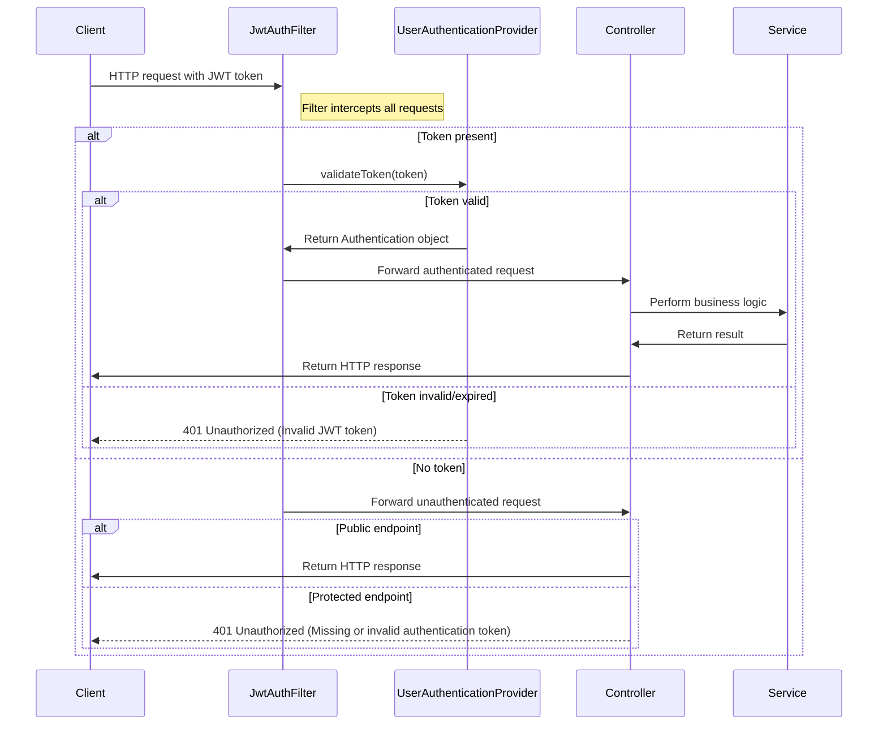
```mermaid
sequenceDiagram
    participant Client
    participant JwtAuthFilter
    participant UserAuthenticationProvider
    participant Controller
    participant Service

    Client->>JwtAuthFilter: HTTP request with JWT token
    note right of JwtAuthFilter: Filter intercepts all requests
    
    alt Token present
        JwtAuthFilter->>UserAuthenticationProvider: validateToken(token)
        
        alt Token valid
            UserAuthenticationProvider->>JwtAuthFilter: Return Authentication object
            JwtAuthFilter->>Controller: Forward authenticated request
            Controller->>Service: Perform business logic
            Service->>Controller: Return result
            Controller->>Client: Return HTTP response
        else Token invalid/expired
            UserAuthenticationProvider-->>Client: 401 Unauthorized (Invalid JWT token)
        end
    else No token
        JwtAuthFilter->>Controller: Forward unauthenticated request
        
        alt Public endpoint
            Controller->>Client: Return HTTP response
        else Protected endpoint
            Controller-->>Client: 401 Unauthorized (Missing or invalid authentication token)
        end
    end
```

_Sequence Diagram showing JWT authentication and request handling flow._

| File                                | Description                                                                    |
| ----------------------------------- | ------------------------------------------------------------------------------ |
| `CorsConfigurationValidator.java`   | Validates CORS configuration at startup to ensure security compliance.         |
| `CustomAccessDeniedHandler.java`    | Handles authenticated but unauthorized requests (403 Forbidden).               |
| `JwtAuthFilter.java`                | Authentication filter that processes JWT tokens for incoming requests.         |
| `PermissionEnum.java`               | Enumeration defining available permissions (read, write, update, delete).      |
| `Role.java`                         | Role entity class representing a user role in the database.                    |
| `RoleEnum.java`                     | Enumeration defining roles (USER, MANAGER, ADMIN) and their permissions.       |
| `RoleRepository.java`               | Interface for database operations related to roles.                            |
| `RoleSeeder.java`                   | Seeds the database with predefined roles on application startup.               |
| `SecurityConfig.java`               | Security configuration defining the filter chain and access rules.             |
| `UserAuthenticationEntryPoint.java` | Handles unauthenticated access by returning a 401 Unauthorized response.       |
| `UserAuthenticationProvider.java`   | Authentication provider for validating JWT tokens and user credentials.        |

---

---

### 1.7 Auth Module (`main/java/auth`)

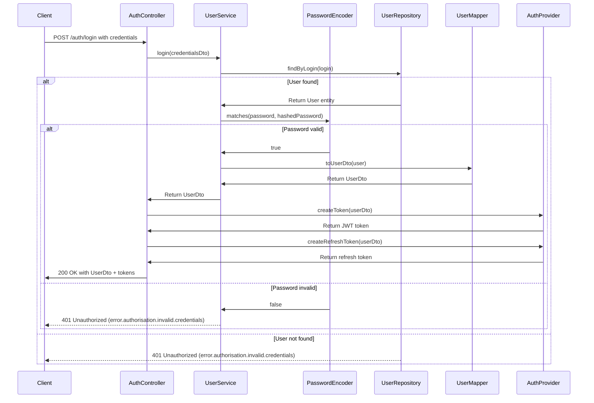
```mermaid
sequenceDiagram
    participant Client
    participant AuthController
    participant UserService
    participant PasswordEncoder
    participant UserRepository
    participant UserMapper
    participant AuthProvider

    Client->>AuthController: POST /auth/login with credentials
    AuthController->>UserService: login(credentialsDto)
    UserService->>UserRepository: findByLogin(login)
    
    alt User found
        UserRepository->>UserService: Return User entity
        UserService->>PasswordEncoder: matches(password, hashedPassword)
        
        alt Password valid
            PasswordEncoder->>UserService: true
            UserService->>UserMapper: toUserDto(user)
            UserMapper->>UserService: Return UserDto
            UserService->>AuthController: Return UserDto
            AuthController->>AuthProvider: createToken(userDto)
            AuthProvider->>AuthController: Return JWT token
            AuthController->>AuthProvider: createRefreshToken(userDto)
            AuthProvider->>AuthController: Return refresh token
            AuthController->>Client: 200 OK with UserDto + tokens
        else Password invalid
            PasswordEncoder->>UserService: false
            UserService-->>Client: 401 Unauthorized (error.authorisation.invalid.credentials)
        end
    else User not found
        UserRepository-->>Client: 401 Unauthorized (error.authorisation.invalid.credentials)
    end
```

_Sequence Diagram showing an example of the authentication flow._

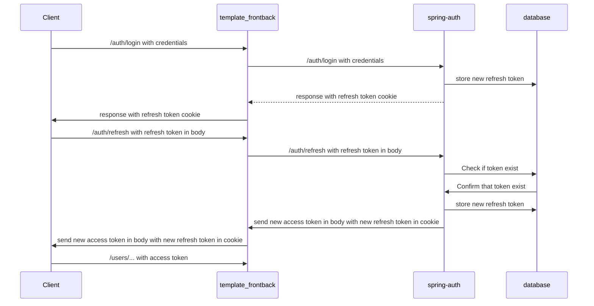
```mermaid
sequenceDiagram
    participant Client
    participant template_frontback
    participant spring-auth
    participant database

    Client->>template_frontback: /auth/login with credentials
    template_frontback->>spring-auth: /auth/login with credentials
    spring-auth->>database: store new refresh token
    spring-auth-->>template_frontback: response with refresh token cookie
    template_frontback->>Client: response with refresh token cookie
    Client->>template_frontback: /auth/refresh with refresh token in body
    template_frontback->>spring-auth: /auth/refresh with refresh token in body
    spring-auth->>database: Check if token exist
    database->>spring-auth: Confirm that token exist
    spring-auth->>database: store new refresh token
    spring-auth->>template_frontback: send new access token in body with new refresh token in cookie
    template_frontback->>Client: send new access token in body with new refresh token in cookie
    Client->>template_frontback: /users/... with access token
```
_Sequence Diagram showing an example of the refresh token workflow._

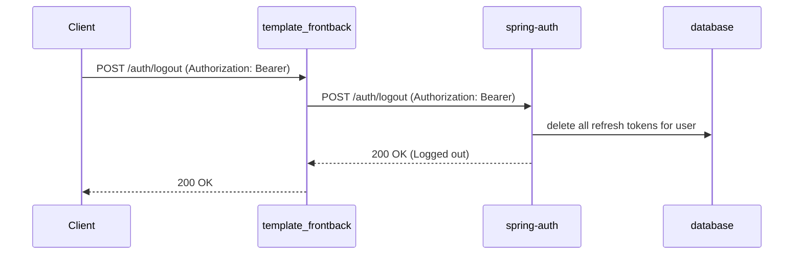
```mermaid
sequenceDiagram
    participant Client
    participant template_frontback
    participant spring-auth
    participant database

    Client->>template_frontback: POST /auth/logout (Authorization: Bearer)
    template_frontback->>spring-auth: POST /auth/logout (Authorization: Bearer)
    spring-auth->>database: delete all refresh tokens for user
    spring-auth-->>template_frontback: 200 OK (Logged out)
    template_frontback-->>Client: 200 OK
```
_Sequence Diagram showing the logout flow and token invalidation._

| File                    | Description                                               |
| ----------------------- | --------------------------------------------------------- |
| `AuthController.java`   | Controller handling user authentication and registration. |
| `CredentialsDto.java`   | Data Transfer Object (DTO) for login credentials.         |
| `PasswordUpdateDto.java` | DTO for handling password update requests.               |
| `RefreshRequestDto.java` | DTO for refresh token requests.                          |
| `TokenResponseDto.java` | DTO for token responses (access token).                   |
| `RefreshToken.java`     | Entity class for storing hashed refresh tokens.           |
| `RefreshTokenRepository.java` | Repository for refresh token database operations.  |
| `OAuth2Controller.java` | Controller handling OAuth2 authentication flows.          |
| `PasswordConfig.java`   | Configuration class for password policies and encryption. |
| `PasswordNotReused.java` | Custom validation constraint for password reuse checks.   |
| `SignUpDto.java`        | DTO for registration functionalities.                     |

---

### 1.8 Users Module (`main/java/user`)

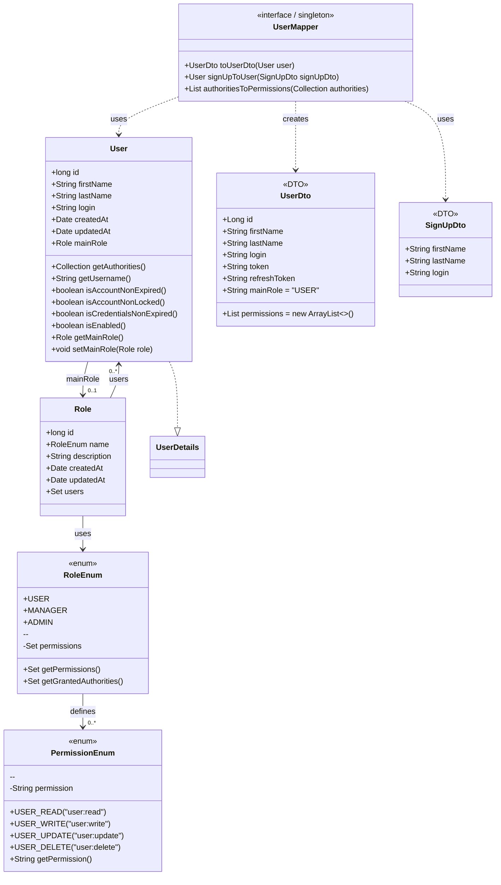
```mermaid
classDiagram
    %% =====================
    %% Entities
    %% =====================
    class User {
        +long id
        +String firstName
        +String lastName
        +String login
        +Date createdAt
        +Date updatedAt
        +Role mainRole
        +Collection<GrantedAuthority> getAuthorities()
        +String getUsername()
        +boolean isAccountNonExpired()
        +boolean isAccountNonLocked()
        +boolean isCredentialsNonExpired()
        +boolean isEnabled()
        +Role getMainRole()
        +void setMainRole(Role role)
    }

    class Role {
        +long id
        +RoleEnum name
        +String description
        +Date createdAt
        +Date updatedAt
        +Set<User> users
    }

    class RoleEnum {
        <<enum>>
        +USER
        +MANAGER
        +ADMIN
        --
        -Set<PermissionEnum> permissions
        +Set<PermissionEnum> getPermissions()
        +Set<SimpleGrantedAuthority> getGrantedAuthorities()
    }

    class PermissionEnum {
        <<enum>>
        +USER_READ("user:read")
        +USER_WRITE("user:write")
        +USER_UPDATE("user:update")
        +USER_DELETE("user:delete")
        --
        -String permission
        +String getPermission()
    }

    %% =====================
    %% DTOs
    %% =====================
    class UserDto {
        <<DTO>>
        +Long id
        +String firstName
        +String lastName
        +String login
        +String token
        +String refreshToken
        +String mainRole = "USER"
        +List<String> permissions = new ArrayList<>()
    }

    class SignUpDto {
        <<DTO>>
        +String firstName
        +String lastName
        +String login
    }

    %% =====================
    %% Mapper
    %% =====================
    class UserMapper {
        <<interface / singleton>>
        +UserDto toUserDto(User user)
        +User signUpToUser(SignUpDto signUpDto)
        +List<String> authoritiesToPermissions(Collection<GrantedAuthority> authorities)
    }

    %% =====================
    %% Relationships
    %% =====================
    User --> "0..1" Role : mainRole
    Role --> "0..*" User : users
    Role --> RoleEnum : uses
    RoleEnum --> "0..*" PermissionEnum : defines
    UserMapper ..> User : uses
    UserMapper ..> UserDto : creates
    UserMapper ..> SignUpDto : uses
    User ..|> UserDetails
```

_Class Diagram showing the `User`, `Role`, `UserDto`, and `SignUpDto` structure._

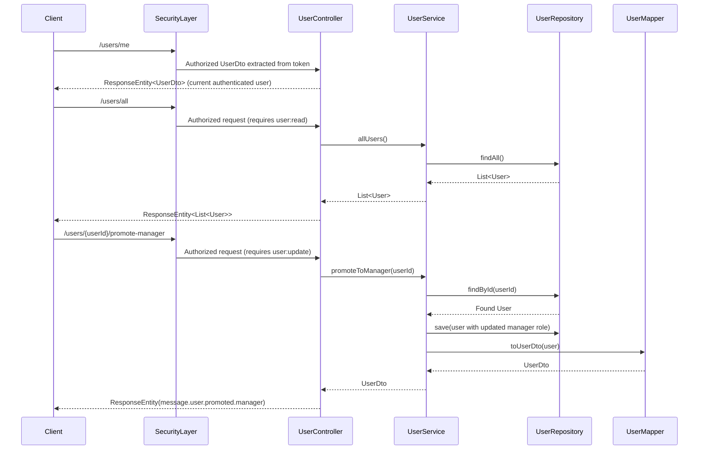
```mermaid
sequenceDiagram
    participant Client
    participant SecurityLayer
    participant UserController
    participant UserService
    participant UserRepository
    participant UserMapper

    %% /users/me
    Client->>SecurityLayer: /users/me
    SecurityLayer->>UserController: Authorized UserDto extracted from token
    UserController-->>Client: ResponseEntity<UserDto> (current authenticated user)

    %% /users/all
    Client->>SecurityLayer: /users/all
    SecurityLayer->>UserController: Authorized request (requires user:read)
    UserController->>UserService: allUsers()
    UserService->>UserRepository: findAll()
    UserRepository-->>UserService: List<User>
    UserService-->>UserController: List<User>
    UserController-->>Client: ResponseEntity<List<User>>

    %% /users/{userId}/promote-manager
    Client->>SecurityLayer: /users/{userId}/promote-manager
    SecurityLayer->>UserController: Authorized request (requires user:update)
    UserController->>UserService: promoteToManager(userId)
    UserService->>UserRepository: findById(userId)
    UserRepository-->>UserService: Found User
    UserService->>UserRepository: save(user with updated manager role)
    UserService->>UserMapper: toUserDto(user)
    UserMapper-->>UserService: UserDto
    UserService-->>UserController: UserDto
    UserController-->>Client: ResponseEntity(message.user.promoted.manager)
```

_Sequence Diagram showing an example of the user management flow._

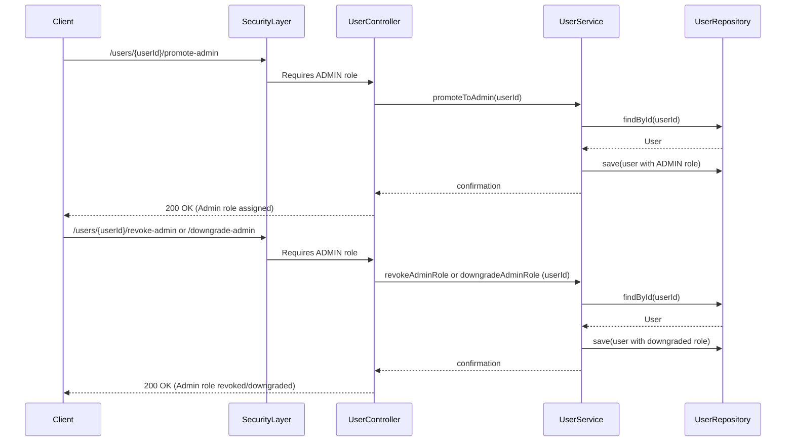
```mermaid
sequenceDiagram
    participant Client
    participant SecurityLayer
    participant UserController
    participant UserService
    participant UserRepository

    %% /users/{userId}/promote-admin
    Client->>SecurityLayer: /users/{userId}/promote-admin
    SecurityLayer->>UserController: Requires ADMIN role
    UserController->>UserService: promoteToAdmin(userId)
    UserService->>UserRepository: findById(userId)
    UserRepository-->>UserService: User
    UserService->>UserRepository: save(user with ADMIN role)
    UserService-->>UserController: confirmation
    UserController-->>Client: 200 OK (Admin role assigned)

    %% /users/{userId}/revoke-admin and /downgrade-admin
    Client->>SecurityLayer: /users/{userId}/revoke-admin or /downgrade-admin
    SecurityLayer->>UserController: Requires ADMIN role
    UserController->>UserService: revokeAdminRole or downgradeAdminRole (userId)
    UserService->>UserRepository: findById(userId)
    UserRepository-->>UserService: User
    UserService->>UserRepository: save(user with downgraded role)
    UserService-->>UserController: confirmation
    UserController-->>Client: 200 OK (Admin role revoked/downgraded)
```
_Sequence Diagram showing admin role assignment and revocation._

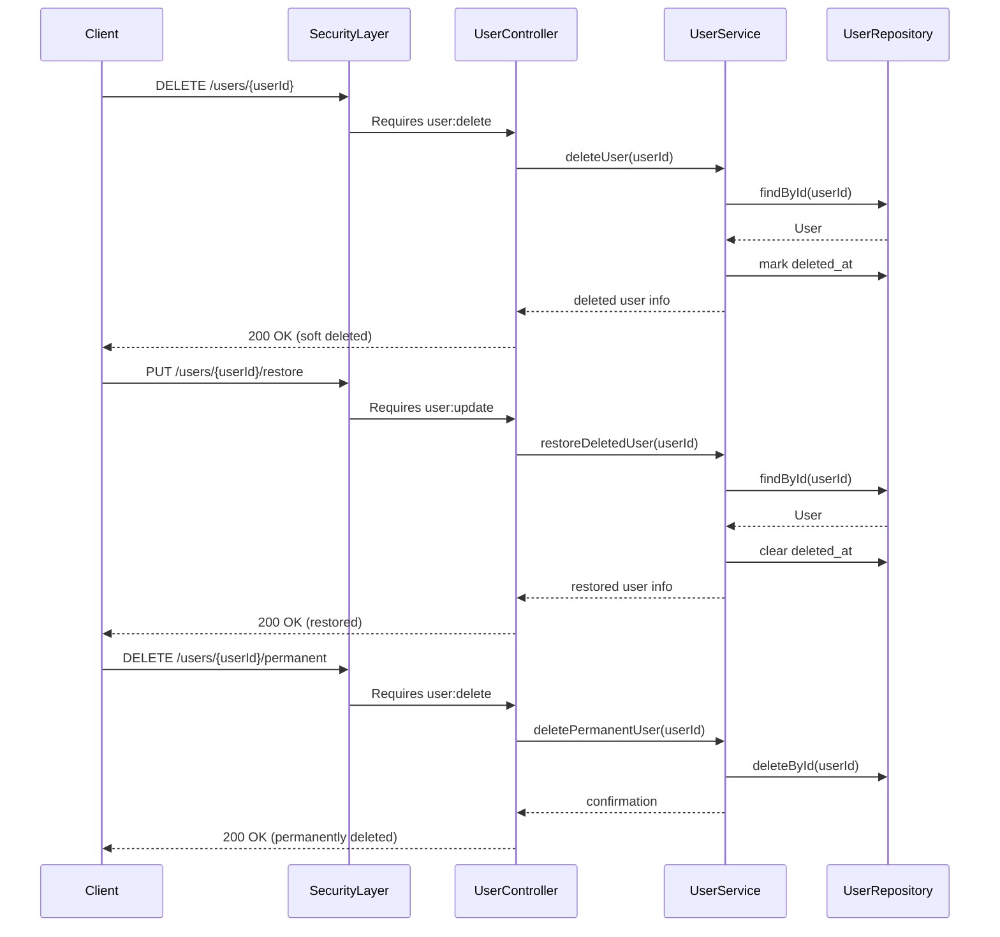
```mermaid
sequenceDiagram
    participant Client
    participant SecurityLayer
    participant UserController
    participant UserService
    participant UserRepository

    %% Soft delete
    Client->>SecurityLayer: DELETE /users/{userId}
    SecurityLayer->>UserController: Requires user:delete
    UserController->>UserService: deleteUser(userId)
    UserService->>UserRepository: findById(userId)
    UserRepository-->>UserService: User
    UserService->>UserRepository: mark deleted_at
    UserService-->>UserController: deleted user info
    UserController-->>Client: 200 OK (soft deleted)

    %% Restore
    Client->>SecurityLayer: PUT /users/{userId}/restore
    SecurityLayer->>UserController: Requires user:update
    UserController->>UserService: restoreDeletedUser(userId)
    UserService->>UserRepository: findById(userId)
    UserRepository-->>UserService: User
    UserService->>UserRepository: clear deleted_at
    UserService-->>UserController: restored user info
    UserController-->>Client: 200 OK (restored)

    %% Permanent delete
    Client->>SecurityLayer: DELETE /users/{userId}/permanent
    SecurityLayer->>UserController: Requires user:delete
    UserController->>UserService: deletePermanentUser(userId)
    UserService->>UserRepository: deleteById(userId)
    UserService-->>UserController: confirmation
    UserController-->>Client: 200 OK (permanently deleted)
```
_Sequence Diagram showing soft delete, restore, and permanent delete._

| File                  | Description                                                                        |
| --------------------- | ---------------------------------------------------------------------------------- |
| `User.java`           | Entity class representing a user in the system.                                    |
| `UserController.java` | Handles HTTP requests related to users.                                            |
| `UserDto.java`        | DTO for communication between backend and frontend.                                |
| `UserMapper.java`     | Handles conversion between `User` entities and `UserDto` objects.                  |
| `UserRepository.java` | Interface for database operations related to users.                                |
| `UserSeeder.java`     | Seeds the database with test users for development.                                |
| `UserService.java`    | Business logic for user functionalities (creation, update, role assignment, etc.). |

---

### 1.9 Configuration Module (`main/java/config`)

| File                | Description                                                         |
| ------------------- | ------------------------------------------------------------------- |
| `MapperConfig.java` | Fallback configuration to expose MapStruct mappers as Spring beans. |

---

### 1.10 Error and Exception Management (`main/java/app`)

**Errors:**

| File                   | Description                                        |
| ---------------------- | -------------------------------------------------- |
| `errors/ErrorDto.java` | Record serving as Data Transfer Object for errors. |

**Exceptions:**

Exceptions are organized within container classes for better organization:

| Container Class | Nested Exception | Description |
| --- | --- | --- |
| `AppException.java` | `AppException` | Base custom exception class for application-specific errors. |
| `GlobalExceptionHandler.java` | | Global exception handler for REST API endpoints. |
| `AuthExceptions.java` | `InvalidCredentialsException` | Thrown when login credentials are invalid. |
| `SecurityExceptions.java` | `RoleNotFoundException` | Thrown when a requested role is not found in the database. |
| `SecurityExceptions.java` | `SecurityException` | Security-related exceptions. |
| `SecurityExceptions.java` | `UnauthorizedActionException` | Thrown when a user attempts an action without proper authorization. |
| `SecurityExceptions.java` | `UserHasLowerRightsException` | Thrown when a user tries to modify another user with higher privileges. |
| `UserExceptions.java` | `UserAlreadyExistsException` | Thrown when attempting to register with an existing login. |
| `UserExceptions.java` | `UserNotFoundException` | Thrown when a requested user is not found in the database. |
| `UserExceptions.java` | `UserAlreadyAdminException` | Thrown when attempting to promote a user who is already an admin. |
| `UserExceptions.java` | `UserAlreadyManagerException` | Thrown when attempting to promote a user who is already a manager. |
| `UserExceptions.java` | `UserAlreadyRegularException` | Thrown when attempting to downgrade a user who is already a regular user. |

---

### 1.11 Test Structure (`test/java`)

| Module/File                     | Description                                                                  |
| ------------------------------- | ---------------------------------------------------------------------------- |
| `security/`                     | Tests related to the security and authentication functionalities of the app. |
| `auth/`                         | Tests related to the authentication endpoints of the app.                    |
| `user/`                         | Tests related to the user management functionalities of the app.             |
| `TemplateApplicationTests.java` | Loads the Spring application context for integration testing.                |
| `TestConfigurationDebug.java`   | Tests the existence of the environment variables.                            |

---

### 1.12 Security Tests (`test/java/security`)

| File                                    | Description                                                    |
| --------------------------------------- | -------------------------------------------------------------- |
| `CustomAccessDeniedHandlerTest.java`    | Tests the custom 403 Forbidden response handler.               |
| `PermissionEnumTest.java`               | Tests the permission enumeration values and getters.           |
| `RoleEnumTest.java`                     | Tests the role enumeration and granted authorities.            |
| `RoleTest.java`                         | Tests the `Role` entity class.                                 |
| `UserAuthenticationEntryPointTest.java` | Tests the 401 Unauthorized entry point handler.                |
| `UserAuthenticationProviderTest.java`   | Tests JWT token validation and authentication provider logic.  |

---

### 1.13 Authentication Tests (`test/java/auth`)

| File                                 | Description                                                               |
| ------------------------------------ | ------------------------------------------------------------------------- |
| `AuthControllerIntegrationTest.java` | Integration tests for authentication endpoints (login, register, etc.).   |
| `CredentialsDtoTest.java`            | Tests the `CredentialsDto` validation and structure.                      |
| `SignUpDtoTest.java`                 | Tests the `SignUpDto` validation constraints.                             |

---

### 1.14 User Tests (`test/java/user`)

| File                                 | Description                                                                          |
| ------------------------------------ | ------------------------------------------------------------------------------------ |
| `TestUserSeeder.java`                | Specialized seeder that creates `User` entities only in test mode.                   |
| `UserControllerIntegrationTest.java` | Tests the methods in `UserController` and saves the results in data files.          |
| `UserControllerDocTest.java`         | Generates the documentation of the methods in `UserController` from the data files. |
| `UserDtoTest.java`                   | Tests the `UserDto` object.                                                          |
| `UserMapperTest.java`                | Tests the `UserMapper` interface.                                                    |
| `UserServiceTest.java`               | Tests the `UserService` class.                                                       |
| `UserTest.java`                      | Tests the `User` entity.                                                             |

---

### 1.15 External Integrations (Microsoft Entra ID / Azure AD)

The `spring-auth` module supports hybrid authentication, combining:

1. Microsoft Entra ID (Azure AD) for enterprise OAuth2/OpenID Connect login.

2. A local JWT-based authentication system for internal API access and session management.

This architecture enables secure single sign-on (SSO) via Azure, while maintaining full control over internal authorization, role assignment, and token refresh lifecycles.

#### 1.15.1 OAuth2 Integration (Azure AD)

When users log in via Microsoft Entra ID, the process follows the standard OAuth2 authorization code flow:

1. Redirect to Microsoft Login

   - Initiated by accessing /oauth2/authorization/azure.

   - Managed automatically by Spring Security (configured in SecurityConfig).

2. Successful Callback

   - Handled by OAuth2Controller at /oauth2/success.

   - Spring Security provides an OAuth2AuthenticationToken containing Azure user info.

3. User Mapping

   - The controller extracts attributes such as:

     - email

     - given_name

     - family_name

   - These are mapped into a local UserDto object.

4. Local User Synchronization

   - If the user doesn’t exist, they are created in the database via UserService.createAzureUser().

   - Azure users are assigned a default role (USER) and stored for local management.

5. JWT Creation and Redirect

   - A local JWT is created using UserAuthenticationProvider.createToken(user).

   - The app redirects the browser to the frontend (http://localhost:{port}/oauth2/success) with the JWT token in the URL query parameters.

#### 1.15.2 OAuth2 Scopes and Claims
Azure AD provides the following standard OpenID Connect scopes in the ID token:

| Scope       | Purpose                                                                 |
| ----------- | ----------------------------------------------------------------------- |
| `openid`    | Identifies the request as an OpenID Connect request.                    |
| `profile`   | Grants access to basic profile information (name, preferred username).  |
| `email`     | Grants access to the user's email address.                              |
| `User.Read` | Allows reading the user's profile information from Microsoft Graph API. |

These are appended as `SCOPE_`-prefixed authorities by `UserAuthenticationProvider.validateTokenStrongly()`.

Example claims that can be extracted from the Azure token:

```json
{
  "sub": "e1b4d240-ef02-4f3d-8b60-8413d0b242a2",
  "name": "John Doe",
  "email": "john.doe@company.com",
  "scp": "openid profile email User.Read"
}
```

---

## 2. API Endpoints Summary

### 2.1 Authentication Endpoints (`/auth`)

| Method | Endpoint             | Auth Required | Description                                    |
| ------ | -------------------- | ------------- | ---------------------------------------------- |
| POST   | `/auth/login`        | No            | Authenticate user and receive JWT tokens       |
| POST   | `/auth/register`     | Yes           | Register a new user account                    |
| POST   | `/auth/refresh`      | Yes           | Refresh access token using refresh token       |
| PUT    | `/auth/update-password` | Yes        | Update current user's password                 |
| POST   | `/auth/logout`       | Yes           | Logout and invalidate refresh tokens            |

### 2.2 OAuth2 Endpoints (`/oauth2`)

| Method | Endpoint                       | Auth Required | Description                              |
| ------ | ------------------------------ | ------------- | ---------------------------------------- |
| GET    | `/oauth2/authorization/azure`  | No            | Redirect to Microsoft login page         |
| GET    | `/oauth2/success`              | Yes           | Callback endpoint after Azure login      |

### 2.3 User Management Endpoints (`/users`)

| Method | Endpoint                        | Permission Required | Description                                  |
| ------ | ------------------------------- | ------------------- | -------------------------------------------- |
| GET    | `/users/me`                     | Authenticated       | Get current authenticated user info          |
| GET    | `/users/all`                    | `user:read`         | Get all active users                         |
| GET    | `/users/all-with-deleted`       | `user:read`         | Get all users including soft-deleted         |
| GET    | `/users/deleted`                | `user:read`         | Get only soft-deleted users                  |
| PUT    | `/users/{userId}/restore`       | `user:update`       | Restore a soft-deleted user                  |
| PUT    | `/users/{userId}/promote-manager` | `user:update`     | Promote user to MANAGER role                 |
| PUT    | `/users/{userId}/revoke-manager` | `user:update`      | Revoke MANAGER role from user                |
| PUT    | `/users/{userId}/promote-admin` | `ADMIN` role        | Promote user to ADMIN role                   |
| PUT    | `/users/{userId}/revoke-admin` | `ADMIN` role         | Revoke ADMIN role from user                  |
| PUT    | `/users/{userId}/downgrade-admin` | `ADMIN` role       | Downgrade admin to MANAGER role              |
| DELETE | `/users/{userId}`               | `user:delete`       | Soft delete a user (marks as deleted)        |
| DELETE | `/users/{userId}/permanent`     | `user:delete`       | Permanently delete a user from database      |

---

## 3. Testing and Documentation

### 3.1 Environment Profiles

The application supports three environment profiles controlled by the `ENVIRONMENT` variable in `.env`:

- **`dev`:** Development mode - runs the application with Spring Boot DevTools, skips tests
- **`test`:** Testing mode - runs the full test suite and generates API documentation
- **`prod`:** Production mode - builds optimized JAR and runs the application

Switch environments by updating `.env`:
```properties
ENVIRONMENT=dev  # or test, or prod
```

### 3.2 Test Execution

The application uses **JUnit 5** and **Spring Boot Test** for testing:

- **Unit Tests:** Test individual components in isolation
- **Integration Tests:** Test complete request/response flows with database interactions
- **Documentation Tests:** Generate API documentation using Spring REST Docs

**Run tests using Docker Compose:**
```bash
# Set environment to test in .env file
ENVIRONMENT=test

# Run tests
docker compose up --build
```

This will:
- Build the application with Maven
- Run the complete test suite (`mvn verify`)
- Generate test reports and API documentation snippets
- Create the database schema for testing

**Run tests locally with Maven (without Docker):**
```bash
mvn test                 # Run tests only
mvn verify              # Run tests + integration tests
```

### 3.3 API Documentation Generation

API documentation is automatically generated using **Spring REST Docs** and **AsciiDoc**:

1. Integration tests capture HTTP requests/responses as snippets (saved to `src/asciidoc/`)
2. AsciiDoc templates combine snippets into comprehensive documentation
3. Maven plugin generates HTML documentation during the build process

**Generated documentation locations:**
- **Snippets:** `target/generated-snippets/` (raw test output)
- **HTML Documentation:** `docs/index.html` (final API documentation)

**Generate documentation using Docker:**
```bash
# Set environment to test
ENVIRONMENT=test

# Build and run tests to generate docs
docker compose up --build

# Documentation will be available in docs/index.html
```

**Generate documentation with Maven:**
```bash
mvn clean package
```

---

## 4. Security Architecture

### 4.1 Authentication Flow

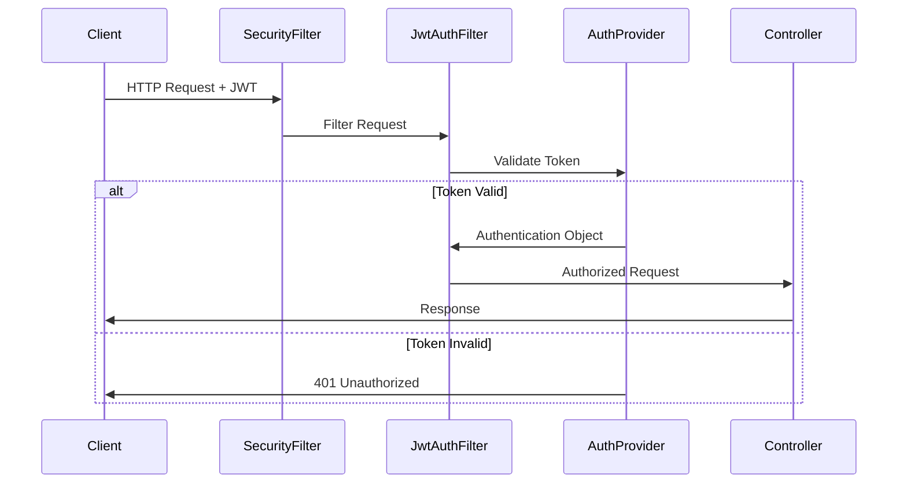
```mermaid
sequenceDiagram
    participant Client
    participant SecurityFilter
    participant JwtAuthFilter
    participant AuthProvider
    participant Controller

    Client->>SecurityFilter: HTTP Request + JWT
    SecurityFilter->>JwtAuthFilter: Filter Request
    JwtAuthFilter->>AuthProvider: Validate Token
    
    alt Token Valid
        AuthProvider->>JwtAuthFilter: Authentication Object
        JwtAuthFilter->>Controller: Authorized Request
        Controller->>Client: Response
    else Token Invalid
        AuthProvider->>Client: 401 Unauthorized
    end
```

### 4.2 Role-Based Access Control

The application implements a hierarchical role system:

- **USER:** Basic permissions (`user:read` for own profile)
- **MANAGER:** User permissions + user management (`user:read`, `user:write`, `user:update`)
- **ADMIN:** All permissions including user deletion (`user:read`, `user:write`, `user:update`, `user:delete`)

### 4.3 Password Security

- **BCrypt hashing** with configurable strength (default: 12)
- **Password reuse validation** prevents updating to same password
- **Secure password handling** using `char[]` instead of `String` in DTOs
- **Minimum length:** 8 characters
- **Maximum length:** 72 characters (BCrypt limitation)

---

## 5. Database Schema

### 5.1 Key Tables

- **`users`:** Stores user accounts with credentials and profile information
- **`roles`:** Defines available roles in the system
- **`user_roles`:** Many-to-many relationship between users and roles
- **`password_history`:** Tracks password changes for reuse prevention

### 5.2 Soft Delete Pattern

Users can be soft-deleted (marked as inactive) or permanently deleted:
- Soft delete: Sets `deleted_at` timestamp, user remains in database
- Permanent delete: Removes user record entirely
- Soft-deleted users can be restored by administrators

---

## 6. Additional Resources

- **Main README:** [README.md](../README.md) - Setup and installation guide
- **API Documentation:** `target/generated-snippets-html/index.html` - Auto-generated API docs
- **Docker Compose:** `compose.yml` - Container orchestration configuration
- **Database Schema:** `init.sql` - Database initialization script

---

**Last Updated:** December 2025  
**Version:** 1.2.0-SNAPSHOT
