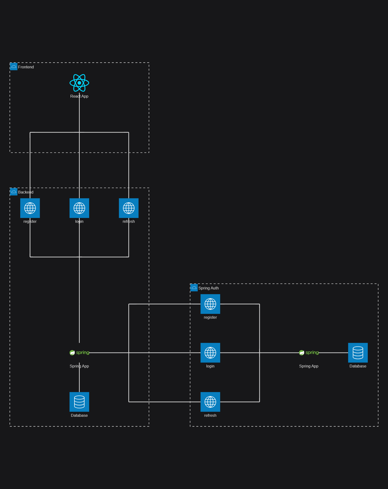
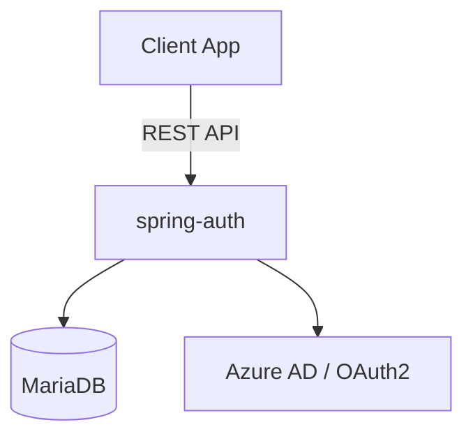
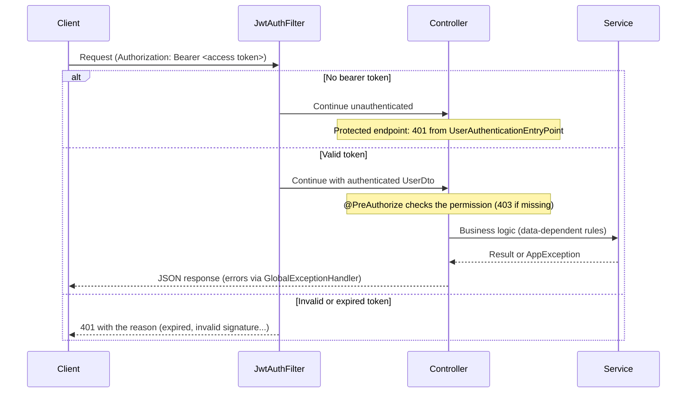
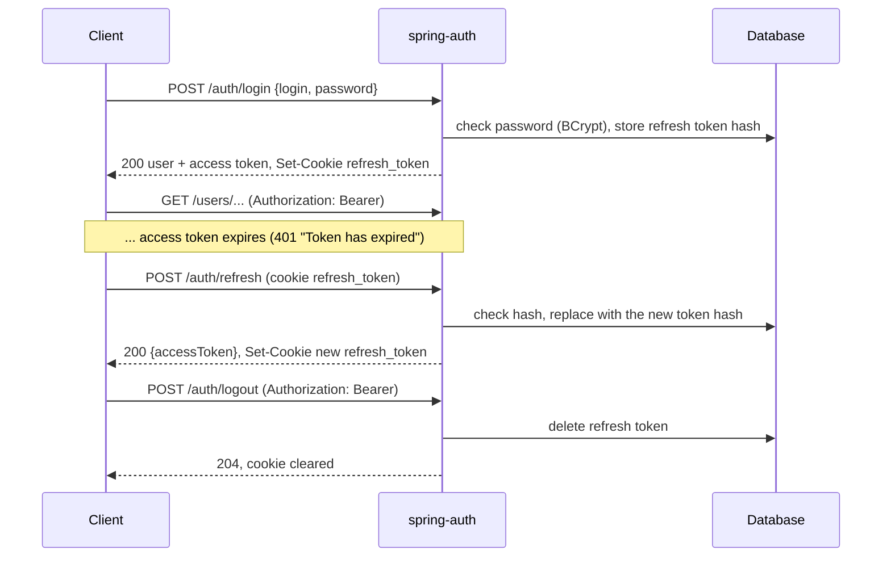
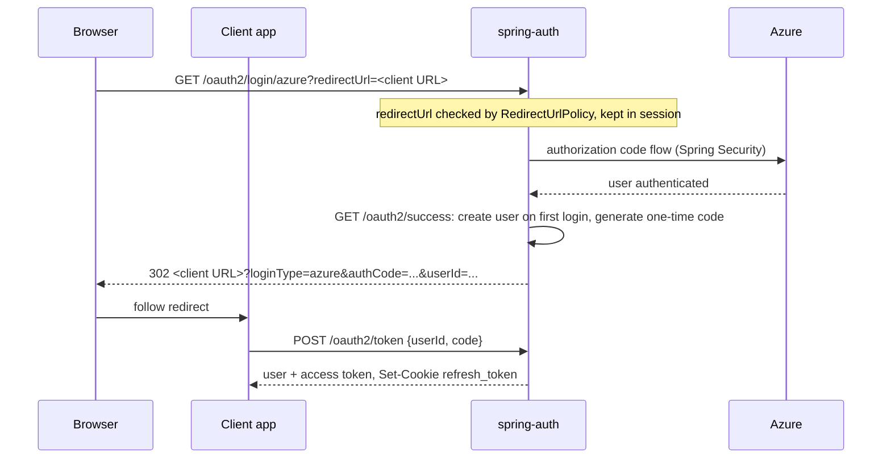

# Application Documentation

Companion guide to the [README](../README.md). Describes application **structure, architecture, and processes**. Setup instructions stay in the README; API endpoint reference and the REST Docs pipeline are covered in separate companion documents (see [section 6](#6-additional-resources)).

## Table of Contents

- [Application Documentation](#application-documentation)
  - [Table of Contents](#table-of-contents)
  - [Documentation Tools](#documentation-tools)
  - [Overview](#overview)
  - [1. Spring-Auth](#1-spring-auth)
    - [1.1 General Information](#11-general-information)
    - [1.2 Root Files](#12-root-files)
    - [1.3 Root Folders](#13-root-folders)
    - [1.4 Source Structure (`src`)](#14-source-structure-src)
      - [1.4.1 `main`](#141-main)
      - [1.4.2 `test`](#142-test)
    - [1.5 Main Java Packages (`main/java`)](#15-main-java-packages-mainjava)
    - [1.6 Request Processing](#16-request-processing)
    - [1.7 Session Flows (`auth`)](#17-session-flows-auth)
    - [1.8 User Management (`user`)](#18-user-management-user)
    - [1.9 Error Handling (`common`)](#19-error-handling-common)
    - [1.10 Test Structure (`test/java`)](#110-test-structure-testjava)
    - [1.11 External Integrations (Microsoft Entra ID / Azure AD)](#111-external-integrations-microsoft-entra-id--azure-ad)
  - [2. API reference](#2-api-reference)
  - [3. Testing](#3-testing)
    - [3.1 Environment Profiles](#31-environment-profiles)
    - [3.2 Test Execution](#32-test-execution)
  - [4. Security Architecture](#4-security-architecture)
    - [4.1 Tokens](#41-tokens)
    - [4.2 Role-Based Access Control](#42-role-based-access-control)
    - [4.3 Password Security](#43-password-security)
  - [5. Database Schema](#5-database-schema)
    - [5.1 Key Tables](#51-key-tables)
    - [5.2 Soft Delete Pattern](#52-soft-delete-pattern)
  - [6. Additional Resources](#6-additional-resources)

---

## Documentation Tools

Recommended Mermaid Preview Tool [Markdown Preview Mermaid Support](https://marketplace.visualstudio.com/items?itemName=bierner.markdown-mermaid).

---

## Overview

This document describes the **structure, components, and processes** of the spring-auth application, including configuration files, folder organization, and module responsibilities.

This application powers an **authentication system** that client applications can use, providing:

- Secure registration, authentication, and authorization
- User list management
- User role management (global role, shared across all client applications)

  
_Illustrates interactions between the frontend and backend of the client app, using the `spring-auth` API._

---

## 1. spring-auth

### 1.1 General Information

`spring-auth` is a standalone Spring Boot application that provides registration, authentication and authorization services. It manages users credentials, roles, and permissions globally, shared between multiple client applications. It also integrates with Microsoft Azure AD for OAuth2 authentication.


```mermaid
graph TD
    A[Client App] -->|REST API| B[spring-auth]
    B --> C[(MariaDB)]
    B --> D[Azure AD / OAuth2]
```

**Tools & Dependencies:**

- **Java / OpenJDK:** 25
- **Spring Boot:** 4.0
- **Maven:** 3.9+
- **MariaDB:** 11.4
- **Docker Desktop** (in dev/test environment) : Latest

**Key Libraries:**

- **Spring Security:** Authentication and authorization framework
- **Spring Data JPA:** Database access and ORM
- **Spring OAuth2 Client:** Microsoft Entra ID (Azure AD) integration
- **Auth0 Java-JWT:** JWT token generation and validation
- **MapStruct:** Java bean mappings and DTO conversions
- **Lombok:** Reduces boilerplate code
- **Spring REST Docs:** API documentation generated from the integration tests
- **Jakarta Validation:** Bean validation and custom constraints
- **spring-dotenv (`springboot4-dotenv`):** loads the `.env` file when running outside Docker

> **Note:** Detailed setup and run instructions are provided in the project's main [`README.md`](../README.md).

---

### 1.2 Root Files

| File                     | Description                                                      |
| ------------------------ | ---------------------------------------------------------------- |
| `pom.xml`                | Defines project dependencies, plugins, and build configurations. |
| `init.sql`               | Creates the `test_db` database next to the dev database in the MariaDB container. |
| `Dockerfile`             | Defines Docker image build stages and application setup.         |
| `compose.yml`            | Configures Docker environment and additional services.           |
| `application.properties` | Local, git-ignored overrides of the Spring Boot configuration (copy of `application.properties-dist`). |
| `.env`                   | Environment variables for local development and deployment.      |
| `README.md`              | Project overview, setup instructions, and documentation links.   |

---

### 1.3 Root Folders

| Folder   | Description                                           |
| -------- | ----------------------------------------------------- |
| `src`    | Contains the application’s source code and resources. |
| `target` | Compiled classes and build artifacts.                 |
| `docs`   | Documentation.                                        |

---

### 1.4 Source Structure (`src`)

#### 1.4.1 `main`

Contains the core functionality of the application.

- **`java`** – Source code (controllers, services, entities, configurations, etc.)
- **`resources`** – Configuration files, static resources, and templates

#### 1.4.2 `test`

Contains test classes for unit and integration tests.

- **`java`** – Test classes corresponding to the application’s source code
- **`resources`** – Test-specific configuration or data

> Test execution and environment profiles are described in [section 3](#3-testing). API documentation generation is covered in [api-documentation-generation.md](api-documentation-generation.md).

---

### 1.5 Main Java Packages (`main/java`)

The code is organized **by feature**: each package groups the controller, service, repository, entities, DTOs and exceptions of one domain. Cross-cutting code lives in `common`, `config` and `security`.

```
ch.sectioninformatique.auth
├── AuthApplication.java            Entry point (main method)
├── auth/                           Sessions: login, refresh, logout
│   ├── AuthController, AuthService, AuthExceptions
│   ├── dto/                        CredentialsDto, TokenResponseDto, AuthCodeExchangeDto
│   ├── token/                      RefreshToken (entity), RefreshTokenRepository,
│   │                               RefreshTokenService, RefreshTokenCookieFactory
│   └── oauth2/                     Azure login: OAuth2Controller, AuthCode (entity),
│                                   AuthCodeRepository, AuthCodeService, RedirectUrlPolicy
├── user/                           Users resource
│   ├── User (entity), UserController, UserService, UserRepository,
│   │   UserMapper, UserStatus, UserExceptions, UserSeeder (dev profile)
│   ├── dto/                        UserDto, CreateUserDto, UpdateUserDto, RoleUpdateDto,
│   │                               PasswordUpdateDto
│   └── validation/                 @PasswordNotReused and its validator
├── role/                           Role (entity), RoleEnum, PermissionEnum,
│                                   RoleRepository, RoleSeeder
├── security/                       SecurityConfig, JwtService, JwtAuthFilter,
│                                   UserAuthenticationEntryPoint, CustomAccessDeniedHandler,
│                                   CorsProperties, CorsConfigurationValidator,
│                                   TokenHasher, SecurityExceptions
├── common/
│   ├── exception/                  AppException (base class), GlobalExceptionHandler
│   └── web/                        ErrorResponse, ErrorResponseWriter
└── config/                         LocaleConfig (i18n), PasswordConfig (BCrypt)
```

Dependencies go in one direction: `auth` uses `user`, `user` uses `role`, and every package may use `security`, `common` and `config`. The `user` package knows nothing about tokens.

Localized messages are stored per feature in `src/main/resources/messages/<feature>/messages_{fr,en}.properties` and discovered automatically by `LocaleConfig`.

---

### 1.6 Request Processing


```mermaid
sequenceDiagram
    participant Client
    participant JwtAuthFilter
    participant Controller
    participant Service

    Client->>JwtAuthFilter: Request (Authorization: Bearer <access token>)
    alt No bearer token
        JwtAuthFilter->>Controller: Continue unauthenticated
        Note over Controller: Protected endpoint: 401 from UserAuthenticationEntryPoint
    else Valid token
        JwtAuthFilter->>Controller: Continue with authenticated UserDto
        Note over Controller: @PreAuthorize checks the permission (403 if missing)
        Controller->>Service: Business logic (data-dependent rules)
        Service-->>Controller: Result or AppException
        Controller-->>Client: JSON response (errors via GlobalExceptionHandler)
    else Invalid or expired token
        JwtAuthFilter-->>Client: 401 with the reason (expired, invalid signature...)
    end
```

Two security filter chains are configured in `SecurityConfig`:

- `/auth/**` and `/users/**`: stateless, authenticated with the access token;
- every other path (`/oauth2/**`, `/login/oauth2/**`): uses an HTTP session, only for the duration of the Azure login.

---

### 1.7 Session Flows (`auth`)


```mermaid
sequenceDiagram
    participant Client
    participant spring-auth
    participant Database

    Client->>spring-auth: POST /auth/login {login, password}
    spring-auth->>Database: check password (BCrypt), store refresh token hash
    spring-auth-->>Client: 200 user + access token, Set-Cookie refresh_token

    Client->>spring-auth: GET /users/... (Authorization: Bearer)
    Note over Client,spring-auth: ... access token expires (401 "Token has expired")

    Client->>spring-auth: POST /auth/refresh (cookie refresh_token)
    spring-auth->>Database: check hash, replace with the new token hash
    spring-auth-->>Client: 200 {accessToken}, Set-Cookie new refresh_token

    Client->>spring-auth: POST /auth/logout (Authorization: Bearer)
    spring-auth->>Database: delete refresh token
    spring-auth-->>Client: 204, cookie cleared
```

| Class | Responsibility |
| ----- | -------------- |
| `AuthController` | `POST /auth/login`, `POST /auth/refresh`, `POST /auth/logout`, `GET /auth/redirect-after-login` |
| `AuthService` | Credential check, OAuth2 code exchange, token issuance, refresh, logout |
| `RefreshTokenService` | Issues (with rotation), verifies and revokes refresh tokens; stores SHA-256 hashes only |
| `RefreshTokenCookieFactory` | Builds the HTTP-only `refresh_token` cookie (SameSite configurable with `SECURITY_REFRESH_COOKIE_SAME_SITE`) |
| `OAuth2Controller` | Azure login flow (see [1.11](#111-external-integrations-microsoft-entra-id--azure-ad)) |
| `AuthCodeService` | One-time, short-lived, hashed authentication codes |
| `RedirectUrlPolicy` | Only accepts local paths and `cors.allowed-origins` as post-login redirect targets |

---

### 1.8 User Management (`user`)

| Endpoint | Permission | Description |
| -------- | ---------- | ----------- |
| `GET /users/me` | authenticated | Current user |
| `PUT /users/me/password` | authenticated | Change own password (204) |
| `GET /users?status=ACTIVE\|DELETED\|ALL` | `user:read` | List users |
| `GET /users/{login}` | `user:read` | Get a user |
| `POST /users` | `user:write` | Create a user (201 + `Location`) |
| `PUT /users/{login}` | `user:update` | Update first name, last name, login |
| `PUT /users/{login}/role` | `user:update` | Change the role |
| `DELETE /users/{login}?permanent=false` | `user:delete` | Soft (default) or permanent delete (204) |
| `POST /users/{login}/restore` | `user:update` | Restore a soft-deleted user |

Rules enforced by `UserService`, on top of the permissions:

- only an `ADMIN` can grant the `ADMIN` role or act on an admin account;
- nobody can change their own role or delete their own account;
- the acting user's role is read from the database, so a role change is effective immediately.

---

### 1.9 Error Handling (`common`)

Business errors extend `AppException`, which carries an HTTP status and an i18n message key. They are grouped by feature in `AuthExceptions`, `UserExceptions` and `SecurityExceptions`.

`GlobalExceptionHandler` converts exceptions raised in controllers, and `ErrorResponseWriter` the errors raised in the security filters, into the same `ErrorResponse` body:

```json
{
  "timestamp": "2026-10-06T10:39:21.285Z",
  "status": 400,
  "error": "Bad Request",
  "message": "Échec de la validation",
  "fieldErrors": { "login": "ne doit pas être vide" }
}
```

`fieldErrors` is only present for validation errors. Unexpected exceptions return a generic `500` message and are logged.

---

### 1.10 Test Structure (`test/java`)

Test packages mirror the main packages. `support/` contains the shared test infrastructure.

| Package / class | Type | Content |
| --------------- | ---- | ------- |
| `support/AbstractIntegrationTest` | base class | Full context, MockMvc, rolled-back transaction per test, REST Docs helper |
| `support/TestUserSeeder`, `TestUsers` | data | Reference users of the test profile (user, manager, two admins, a soft-deleted user) |
| `support/TestOAuth2ClientConfig` | config | Static Azure registration: tests never contact Azure |
| `support/RestDocsSnippets` | contracts | Documented fields, parameters, headers and cookies |
| `support/RestDocsSensitiveDataMasking` | docs | Masks tokens in generated snippets |
| `auth/AuthControllerIntegrationTest` | integration | Login, refresh (rotation), logout, token errors, languages |
| `auth/oauth2/OAuth2ControllerIntegrationTest` | integration | Azure flow, open-redirect protection, code exchange |
| `auth/oauth2/AuthCodeServiceTest` | integration | Code hashing, single use, expiration |
| `user/UserControllerIntegrationTest` | integration | Every `/users` endpoint and authorization rule |
| `ApiDocumentationCoverageTest` | integration | Every endpoint must be described in `index.adoc` |
| `user/UserServiceTest` | unit (Mockito) | Business rules of user management |
| `security/JwtServiceTest`, `TokenHasherTest` | unit | Token creation and verification |
| `security/CorsConfigurationValidatorTest`, `SecurityErrorHandlersTest` | unit | CORS startup checks, 401/403 bodies |
| `auth/oauth2/RedirectUrlPolicyTest` | unit | Accepted and rejected redirect URLs |
| `*DtoTest`, `UserDtoValidationTest` | unit | Bean Validation rules |
| `role/RoleEnumTest`, `user/UserTest`, `user/UserMapperTest` | unit | Permission matrix, entity and mapping |

---

### 1.11 External Integrations (Microsoft Entra ID / Azure AD)

Users can log in with their Microsoft account. Azure only authenticates them: roles, tokens and sessions are managed by spring-auth exactly as for a password login.


```mermaid
sequenceDiagram
    participant Browser
    participant Client app
    participant spring-auth
    participant Azure

    Browser->>spring-auth: GET /oauth2/login/azure?redirectUrl=<client URL>
    Note over spring-auth: redirectUrl checked by RedirectUrlPolicy, kept in session
    spring-auth->>Azure: authorization code flow (Spring Security)
    Azure-->>spring-auth: user authenticated
    spring-auth->>spring-auth: GET /oauth2/success: create user on first login, generate one-time code
    spring-auth-->>Browser: 302 <client URL>?loginType=azure&authCode=...&userId=...
    Browser->>Client app: follow redirect
    Client app->>spring-auth: POST /oauth2/token {userId, code}
    spring-auth-->>Client app: user + access token, Set-Cookie refresh_token
```

Tokens never appear in URLs: only the one-time code (5 minutes by default, `SECURITY_AUTHENTICATION_CODES_LIFETIME`), stored hashed and deleted when used.

The attributes `email` (required), `given_name` (or `name` as fallback) and `family_name` (optional) are read from the Azure user. The requested scopes are `openid`, `profile`, `email` and `User.Read`.

---

## 2. API reference

Endpoint documentation is **generated automatically** from integration tests (Spring REST Docs) during `mvn verify` / `mvn package`. Do not maintain a manual endpoint summary here: it would drift from the code.

| Resource | Role |
| -------- | ---- |
| [index.html](index.html) | Published API reference (HTML) |
| [api-documentation-generation.md](api-documentation-generation.md) | How snippets, Asciidoctor, and Docker volumes produce that HTML |
| [src/asciidoc/index.adoc](../src/asciidoc/index.adoc) | AsciiDoc template (structure and `{snippets}` includes) |

---

## 3. Testing

### 3.1 Environment Profiles

The application supports three environment profiles controlled by the `ENVIRONMENT` variable in `.env`:

- **`dev`:** Development mode - runs the application with Spring Boot DevTools, skips tests
- **`test`:** Testing mode - runs the full test suite and generates API documentation
- **`prod`:** Production mode - builds optimized JAR and runs the application

Switch environments by updating `.env`:
```properties
ENVIRONMENT=dev  # or test, or prod
```

### 3.2 Test Execution

The tests use **JUnit 5**, **Mockito**, **AssertJ** and **Spring Boot Test**:

- **Unit tests** check one class in isolation, without Spring context (fast).
- **Integration tests** send real HTTP requests through MockMvc to the full application, backed by the MariaDB test database. Each test runs in a transaction that is rolled back, so tests are independent. They also produce the REST Docs snippets (see [api-documentation-generation.md](api-documentation-generation.md)).

The test profile is self-contained: secrets and Azure settings have test defaults in `src/test/resources/application-test.properties`, and no network access to Azure is needed. Only the database URL is required (`TEST_SPRING_DATASOURCE_URL`).

**Run tests using Docker Compose:**
```bash
# Set environment to test in .env file
ENVIRONMENT=test

# Run tests and build the documentation
docker compose up --build
```

**Run tests locally with Maven (MariaDB reachable from the host):**
```bash
TEST_SPRING_DATASOURCE_URL=jdbc:mariadb://localhost:3306/test_db ./mvnw test   # tests only
TEST_SPRING_DATASOURCE_URL=jdbc:mariadb://localhost:3306/test_db ./mvnw verify # tests + HTML documentation
```

---

## 4. Security Architecture

### 4.1 Tokens

| Token | Lifetime | Transport | Content | Storage |
| ----- | -------- | --------- | ------- | ------- |
| Access token | 5 min (`SECURITY_JWT_TOKEN_ACCESS_TOKEN_LIFETIME`) | `Authorization: Bearer` header | login, names, role, permissions | not stored |
| Refresh token | 30 days (`SECURITY_JWT_TOKEN_REFRESH_TOKEN_LIFETIME`) | `refresh_token` HTTP-only cookie | login | SHA-256 hash, one per user |
| Authentication code | 5 min (`SECURITY_AUTHENTICATION_CODES_LIFETIME`) | redirect URL query parameter | random UUID | SHA-256 hash, single use |

Access and refresh tokens are signed (HMAC-SHA256) with two different secrets, so one cannot be used in place of the other. Each refresh replaces the refresh token (rotation): a stolen refresh token stops working as soon as the legitimate client refreshes.

### 4.2 Role-Based Access Control

| Role | `user:read` | `user:write` | `user:update` | `user:delete` |
| ---- | :---------: | :----------: | :-----------: | :-----------: |
| `USER` | yes | | | |
| `MANAGER` | yes | yes | yes | |
| `ADMIN` | yes | yes | yes | yes |

Permissions are checked on each endpoint with `@PreAuthorize`. Additional rules depending on the target user are listed in [1.8](#18-user-management-user).

### 4.3 Password Security

- **BCrypt hashing** (`PasswordConfig`)
- **Length:** 8 to 72 characters (BCrypt only uses the first 72 bytes)
- **Password reuse validation** prevents updating to the same password (`@PasswordNotReused`)
- **`char[]` in DTOs**: passwords are wiped from memory once checked or hashed
- **Same error for unknown login and wrong password**, so that the API does not reveal which accounts exist

---

## 5. Database Schema

### 5.1 Key Tables

The schema is generated by Hibernate from the entities.

- **`users`:** accounts (names, login, BCrypt password hash, `deleted` flag, `main_role_id`)
- **`roles`:** the three roles, seeded at startup by `RoleSeeder`
- **`refresh_tokens`:** hash and expiration of the current refresh token of each user
- **`auth_codes`:** hash and expiration of pending Azure authentication codes

### 5.2 Soft Delete Pattern

Users can be soft-deleted or permanently deleted:
- Soft delete (default): sets `deleted = true`; the user can no longer log in and is hidden from `GET /users`, but keeps their login
- Restore: `POST /users/{login}/restore` sets `deleted = false`
- Permanent delete (`?permanent=true`): removes the user record

---

## 6. Additional Resources

| Resource | Description |
| -------- | ----------- |
| [README.md](../README.md) | Setup, Docker, Maven, OAuth2 overview |
| [index.html](index.html) | Published API reference (generated from tests) |
| [api-documentation-generation.md](api-documentation-generation.md) | REST Docs pipeline, commands, Draw.io diagrams |
| `compose.yml` | Container orchestration configuration |
| `init.sql` | Database initialization script |

---

**Last Updated:** October 2026  
**Version:** 1.2.0-SNAPSHOT
